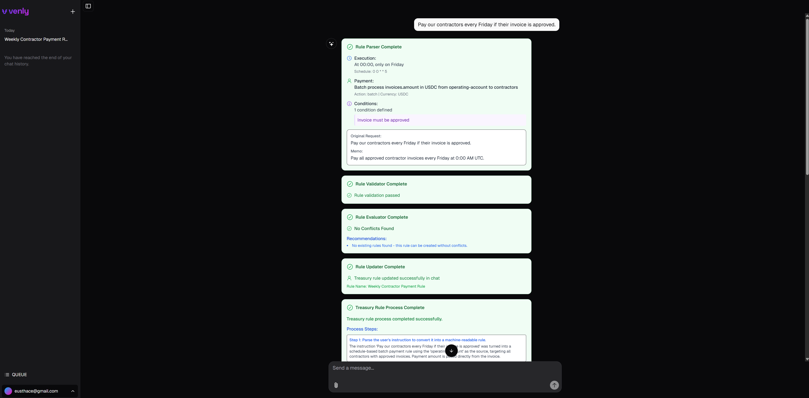

<a href="https://chat.vercel.ai/">
  
  <h1 align="center">Treasury Automation Challenge</h1>
</a>

<p align="center">
    The Treasury Automation Challenge is a real-time, AI-powered platform for conversational treasury operations—a fintech product that lets users create, manage, and simulate payment rules via chat. It integrates natural language processing, secure simulation, scheduled execution, and a dynamic financial context system.
</p>

<p align="center">
  <a href="https://www.venly.io/"><strong>venly.io (Hacked this challenge)</strong></a> ·
  <a href="#features"><strong>Features</strong></a> ·
  <a href="#model-providers"><strong>Model Providers</strong></a> ·
  <a href="#running-locally"><strong>Running locally</strong></a>
</p>
<br/>

## Features

- [Next.js](https://nextjs.org) App Router
  - Advanced routing for seamless navigation and performance
  - React Server Components (RSCs) and Server Actions for server-side rendering and increased performance
- [AI SDK](https://sdk.vercel.ai/docs)
  - Unified API for generating text, structured objects, and tool calls with LLMs
  - Hooks for building dynamic chat and generative user interfaces
  - Supports xAI (default), OpenAI, Fireworks, and other model providers
- [shadcn/ui](https://ui.shadcn.com)
  - Styling with [Tailwind CSS](https://tailwindcss.com)
  - Component primitives from [Radix UI](https://radix-ui.com) for accessibility and flexibility
- Data Persistence
  - [Neon Serverless Postgres](https://vercel.com/marketplace/neon) for saving chat history, rules and user data
  - [Upstash Redis](https://vercel.com/marketplace/upstash) for context cache
  - [Upstash QStash](https://upstash.com/docs/qstash/overall/getstarted) for efficient scheduling and queues
  - [Vercel Blob](https://vercel.com/storage/blob) for efficient file storage
- [Auth.js](https://authjs.dev)
  - Simple and secure authentication

## Model Providers

This template ships with **OpenAI GPT-4.1 Mini** as the default chat model. However, models from **xAI** (`grok-2-1212`), **Anthropic Claude**, and **DeepSeek** are also implemented and can be used simply by changing the option in the `.env` file (not tested). Thanks to the [AI SDK](https://sdk.vercel.ai/docs), switching providers is seamless—just update your configuration without changing the code.


## Running locally

You will need to use the environment variables [defined in `.env.example`](.env.example) to run the project. 

> Note: You should not commit your `.env.local` file or it will expose secrets that will allow others to control access to your various AI and authentication provider accounts.

To get started:

1. **Clone the repository** and create a **Vercel project**.
2. Set up infrastructure:
   * **Neon PostgreSQL** for the database: [Neon Serverless Postgres](https://vercel.com/marketplace/neon).
   * **Upstash Redis** for context caching: [Upstash Redis](https://vercel.com/marketplace/upstash).
   * **Vercel Blob** for file storage: [Vercel Blob](https://vercel.com/docs/storage/vercel-blob).
   > In fact, you can even write a payment rule on paper, upload the file, and ask the agent to process it.
   * **Upstash QStash** for scheduled task execution and queues: [Upstash QStash](https://console.upstash.com/).
3. (Optional) To use other AI models like **xAI**, **Anthropic Claude**, or **DeepSeek**, just switch the provider in your `.env` file.
4. **IMPORTANT > For AI telemetry**, it's strongly required to create an account with [Laminar](https://laminar.ai) and obtain an API key to enable observability and insights into agent behavior.

Once setup is complete, you can begin by running the following (ensure Node 22 and pnpm 9.12.3 are installed):

```bash
pnpm install
pnpm run db:migrate
pnpm dev
```

The application should now be running at [localhost:3000](http://localhost:3000).
