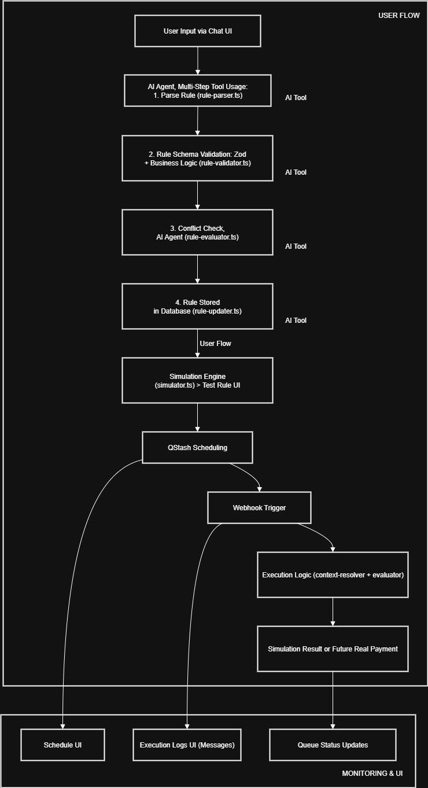

# Treasury Automation Challenge

This project is an AI-powered chatbot application for managing treasury operations through natural language. It enables users to create, simulate, and schedule complex payment rules with conversational AI, simulating real-world treasury scenarios using mock financial data.

## 🧠 Purpose

* **Primary Goal**: Treasury management automation via chat.
* **Core Feature**: "Chat-as-rule-storage" — rules are embedded directly in chat records.

## 🚀 Stack Overview

| Layer          | Tech Stack                                       |
| -------------- | ------------------------------------------------ |
| Frontend       | React 19, TailwindCSS, shadcn/ui                 |
| Backend        | Next.js 15 (App Router), TypeScript, PostgreSQL  |
| AI Integration | Vercel AI SDK (OpenAI, Anthropic, DeepSeek, xAI) |
| Scheduling     | Upstash QStash for cron + delay execution        |
| ORM & DB       | Drizzle ORM, PostgreSQL                          |
| Observability  | OpenTelemetry, LMNR                              |
| Validation     | Zod                                              |
| Simulation     | Custom treasury rule simulator                   |
| Testing        | Playwright E2E                                   |

## 📁 Key Features

AI Agent, multi-step tool usage
* AI parses user chat into executable treasury rules
* Zod + business validation
* AI conflict detection
* Rules stored in the chat message record
* Execution scheduling via QStash
* Queue UI for logs, status, and cron schedules
* Simulation-first execution for safety

## 📜 Architecture

* Chat input → AI parsing → Rule validation → AI conflict detection → Store rule → (Simulation) → QStash schedule → Execution webhook → Result monitoring

See diagram below.

## 🧭 Flow Diagram



## 📦 Breakdown


### 🧠 How Treasury Rules Work

In our system, a **rule** is a structured way to describe a payment instruction using natural language. It gets converted into a JSON object with fields like:

```ts
{
  payment: { ... },
  execution: { ... },
  conditions: [ ... ],
  memo: "Optional text explanation"
}
```

This structure is then processed in **key steps** / AI Agent, multi-step tool usage:

---

### 1. 🗣 Parsing (`rule-parser.ts`)

> The AI reads the user's natural language (like *"Pay contractors every Friday if invoices are approved"*)
> → and converts it into a structured JSON rule (`ruleData`) using patterns and examples.

---

### 2. ✅ Validation (`rule-validator.ts`)

> The system uses **Zod schemas** and custom logic to check that the rule makes sense:

* Are all required fields present?
* Is the cron expression valid?
* Do percentages add up to 100 for split payments?
* Are the conditions formatted properly?

This step ensures the rule is complete and safe before saving or executing it.

---

### 3. ⚠️ **Conflict Detection** (`rule-evaluator.ts`)

> AI detects logic or scheduling conflicts:

* Duplicate rules (e.g. paying same contractors on overlapping schedules)
* Conflicting conditions
* Payment collisions (e.g. two rules trying to spend the same funds)

Helps prevent dangerous or redundant rules from being saved.

---

### 4. 📬 **Rule Updater** (`rule-updater.ts`)

> After passing validation and conflict checks:

* Saves the rule (`ruleData` field)
* Adds metadata (like `memo`, `scheduleId`, `isActive`)
* Schedules future execution via **QStash** (if it’s a timed rule, once / QStash queue)

---

### 5. 🧠 Context Resolution (`context-resolver.ts`)

> Some rules refer to things like **contractors**, **invoices**, **accounts**, etc.
> The mock data covers these collections: accounts, employees, contractors, individuals, businesses, invoices, and treasury.

The context resolver figures out what those actually mean, dynamically linking:

* `"beneficiary": "contractors"` → list of real wallet addresses
* `"amount.value": "invoice.amount"` → finds values in mock invoice data

---

### 6. 📐 Formula Evaluation (`formula-evaluator.ts`)

> If a rule includes calculations (e.g. "50% of net profit"), the formula evaluator safely computes the values.

It avoids risky code execution by parsing expressions securely using math logic, not `eval()`.

---

### 7. 🧪 Simulation (`simulator.ts`)

> Before any fake/real execution, rules are tested with current data:

* Do we have enough balance?
* Who gets paid and how much?
* Are any conditions preventing execution?

Simulation outputs a detailed result — like a dry run — and is used in the UI and webhook execution.

---

## 🧱 The Rule Schema: Core Fields

```ts
{
  payment: {
    action: "simple" | "split" | "batch" | "leftover" | "calculation",
    source: "account-slug" or "wallet-address"
    amount: { "source": "COLLECTION.FIELD", "formula": "* 0.1"}, // or fixed "amount": "1000",
    beneficiary: ["wallet1", "wallet2"] or ["COLLECTION"],
    currency: "USDC",
    percentages: [optional for split],
    tags: [optional], // only for batch payments to filter invoices/items
  },
  execution: {
    timing: "once" | "schedule" | "hook",
    at: <timestamp>, // for once
    cron: <cron string>, // for schedule
    hooks: [event triggers], // for hook
  },
  conditions: [ // optional
    {
      source: "accounts" | "invoices" | "treasury",
      field: "balance" | "status" | ...,
      operator: "==", "<", ">=", etc.
      value: any
    }
  ],
  memo: "human-readable explanation"
}
```

---

### Chat-as-Rule-Storage

* Rules are embedded in the `chats` table as `ruleData` (JSONB)
* No dedicated rule table simplifies context-aware AI interaction

### AI Tooling

Located in `lib/ai/tools/`, each rule goes through:

1. `rule-parser.ts` — NL → JSON
2. `rule-validator.ts` — Zod validation
3. `rule-evaluator.ts` — conflict detection
4. `rule-updater.ts` — stores & syncs to QStash schedule / queue

### Simulation Engine

* `lib/treasury/simulator.ts`
* Performs dry-run validation based on account balances, beneficiaries, and conditions

### Context Resolution

* `context-resolver.ts` maps dynamic entities like `contractors`, `accounts`, `invoices`, `treasury`

### Scheduling: QStash

* Rules get scheduled via Upstash QStash (`lib/qstash/`)
* Modes:

  * `schedule` → cron-based
  * `once` → delayed single exec

### Webhook Execution

* Triggered by QStash → `app/api/chat/qstash/` /queue (fake execution)
* Verifies conditions → re-runs simulation → logs result

### UI Interfaces

* `/chat/[id]`: Main rule creation interface
* `/queue`: Logs + schedules tabbed UI
* `components/queue/*`: All real-time queue management components


## 🔁 Summary of the Rule Lifecycle

| Step                | File                   | Purpose                             |
| ------------------- | ---------------------- | ----------------------------------- |
| 1. Parse            | `rule-parser.ts`       | Turn NL into structured rule        |
| 2. Validate         | `rule-validator.ts`    | Check format, schema, logic         |
| 3. Detect Conflicts | `rule-evaluator.ts`    | Prevent overlap, redundancy         |
| 4. Store + Schedule | `rule-updater.ts`      | Save in DB + schedule in QStash     |
| 5. Resolve Context  | `context-resolver.ts`  | Replace references with real values |
| 6. Evaluate Formula | `formula-evaluator.ts` | Compute math expressions safely     |
| 7. Simulate         | `simulator.ts`         | Run dry-run and check outcome       |

## 🛠 How to Run

See [README.md](../README.md) and [ONBOARDING.md](./ONBOARDING.md), and [HANDOFF.md](./HANDOFF.md).


## 🧩 Extending the Project

This project is built to be extensible. You can integrate real payment processors, expand rule types with new logic or condition handlers, and connect additional data sources for richer treasury context. The AI agent can be extended with new tools or enhanced reasoning models, or any improvements in parsing, validation, or execution flow. You can even build multi-tenant support or embed this system into a broader financial automation suite.


## ❓ Open Tradeoff

> We store rules inside chat messages instead of a dedicated rules table.

**Pros**:

* Unified UX
* Simpler DB schema
* Easier to evolve with conversation

**Cons**:

* Harder to index
* More brittle schema coupling

We chose this to align with the conversational UX and simplify short-term implementation.


## ⚠️ Known Issues

* **AI loop on incomplete input**: Currently using GPT-4.1 mini, asking for rules like *“Split profits 60/40 between founders after expenses”* can cause the model to loop if required context (e.g., profit or expense data) is missing.
* **'Once' payment timing bug**: Rules with `execution.timing = "once"` may not correctly generate a QStash queue message.
* **Mock payment execution inactive**: The current mock payout step does not perform any action—rules are only simulated, not executed.
* **Orphaned QStash schedules**: Deleting a chat or rule may not remove its associated QStash schedule, leading to orphaned scheduled tasks.

---

## 🔁 Handoff & Next Steps

See [HANDOFF.md](./HANDOFF.md) for what should be documented if this is handed off to another dev or team.

---

# ❗❗❗IMPORTANT

> This codebase is NOT production ready, but we have a with strong architecture, typed validation, modular AI tools, and a possible clear roadmap for full real-world integration.
